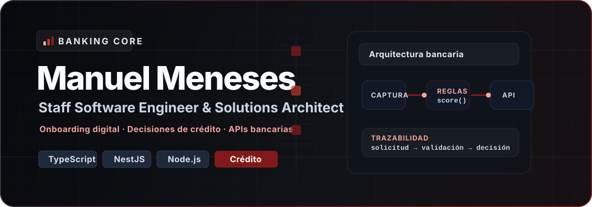

  

  <strong>Arquitectura de software, sistemas financieros y tooling ejecutable para equipos TypeScript.</strong>

  
  
  
  

  
  
  
  
  
  
  

---

Construyo sistemas backend y full-stack de misión crítica donde las reglas de negocio, la trazabilidad, la confiabilidad y la disciplina de entrega pesan más que la arquitectura decorativa. Mi narrativa técnica actual está centrada en originación de productos financieros, flujos de decisión automatizados, diseño de APIs, CI/CD, automatización de infraestructura y estándares de ingeniería ejecutables.

<table>
  <tr>
    <td width="50%" valign="top">
      <h3>Enfoque profesional</h3>
      <ul>
        <li>Staff Software Engineer</li>
        <li>Solutions Architect</li>
        <li>TypeScript / Backend Architect</li>
        <li>Full-Stack Technical Lead</li>
      </ul>
    </td>
    <td width="50%" valign="top">
      <h3>Dominios fuertes</h3>
      <ul>
        <li>Banca y FinTech</li>
        <li>Originación de crédito</li>
        <li>Onboarding digital</li>
        <li>Motores de decisión y BPMN</li>
      </ul>
    </td>
  </tr>
  <tr>
    <td width="50%" valign="top">
      <h3>Stack principal</h3>
      
TypeScript, JavaScript, Node.js, NestJS, Next.js, React, Angular, Python, PostgreSQL, Azure DevOps, Azure App Services, GitHub Actions, Camunda 8 / Zeebe, Playwright y Cypress.

    </td>
    <td width="50%" valign="top">
      <h3>Señal técnica</h3>
      
APIs empresariales, límites backend, CI/CD, infraestructura automatizada, observabilidad, manejo resiliente de errores y tooling para reducir fricción en equipos de ingeniería.

    </td>
  </tr>
</table>

## Tooling Público

| Proyecto | Señal técnica | Enlaces |
| --- | --- | --- |
| `@skapxd/eslint-opinionated` | Reglas arquitectónicas reutilizables para TypeScript, React, backend, frontend y paquetes. Convierte estándares de ingeniería en validaciones ejecutables. | [GitHub](https://github.com/skapxd/eslint-opinionated) · [npm](https://www.npmjs.com/package/@skapxd/eslint-opinionated) |
| `@skapxd/excel2md` | Conversión de Excel a Markdown preservando fórmulas y coordenadas de celdas para pasar hojas complejas a agentes de AI sin perder trazabilidad. | [GitHub](https://github.com/skapxd/excel2md) · [npm](https://www.npmjs.com/package/@skapxd/excel2md) · [Web](https://excel2md-web.vercel.app/) |
| `@skapxd/tree` | CLI para estructura de proyectos y outlines de archivos, orientado a documentación, inspección de codebases y contexto legible para AI. | [GitHub](https://github.com/skapxd/tree) · [npm](https://www.npmjs.com/package/@skapxd/tree) |
| `@skapxd/result` | Manejo de errores type-safe para TypeScript inspirado en `Result` de Rust; reemplaza flujos frágiles basados en excepciones por resultados explícitos. | [GitHub](https://github.com/skapxd/result) · [npm](https://www.npmjs.com/package/@skapxd/result) |
| `nestjs-events-flow` | Documentación y visualización de flujos de eventos en NestJS para sistemas donde el comportamiento asíncrono debe ser entendible y revisable. | [GitHub](https://github.com/skapxd/nestjs-events-flow) · [npm](https://www.npmjs.com/package/nestjs-events-flow) |

<strong>Ecosistema relacionado:</strong> <a href="https://github.com/skapxd/skapxd-eslint"><code>@skapxd/eslint</code></a> mantiene presets ESLint flat config para proyectos TypeScript, React, Astro y Next.js, y complementa el trabajo más estricto de <code>@skapxd/eslint-opinionated</code>. <a href="https://www.npmjs.com/package/@skapxd/eslint">npm</a>

## Señal Técnica Actual

- Sistemas bancarios y FinTech: onboarding digital, originación de crédito, motores de decisión, automatización de reglas de negocio y trazabilidad operativa.
- Ejecución arquitectónica: contratos de API, límites backend, CI/CD, automatización de infraestructura, delivery en Azure, observabilidad y manejo resiliente de errores.
- Ingeniería asistida por AI: herramientas y flujos que hacen más consumible el contexto de repositorios, hojas de cálculo, estándares de lint y entradas de revisión de código.
- Disciplina de producto: los artefactos públicos deben cargar, explicar el posicionamiento más fuerte y evitar demos obsoletas o enlaces a repos privados que terminan en 404 para visitantes externos.

## Escritura Seleccionada

- [Sagas Coreografiadas en NestJS](https://medium.com/@manulondoo/adi%C3%B3s-al-infierno-del-debugging-coreografiando-sagas-en-nestjs-sin-perder-la-cordura-d27d091b9b76)

## Enlaces Públicos Verificados

  <a href="https://github.com/skapxd/skapxd/blob/main/cv-manuel-meneses.pdf">CV PDF</a> ·
  <a href="https://excel2md-web.vercel.app/">Aplicación web de excel2md</a> ·
  <a href="https://github.com/skapxd?tab=repositories">Repositorios en GitHub</a> ·
  <a href="https://www.npmjs.com/~skapxd">Paquetes npm</a>

  

