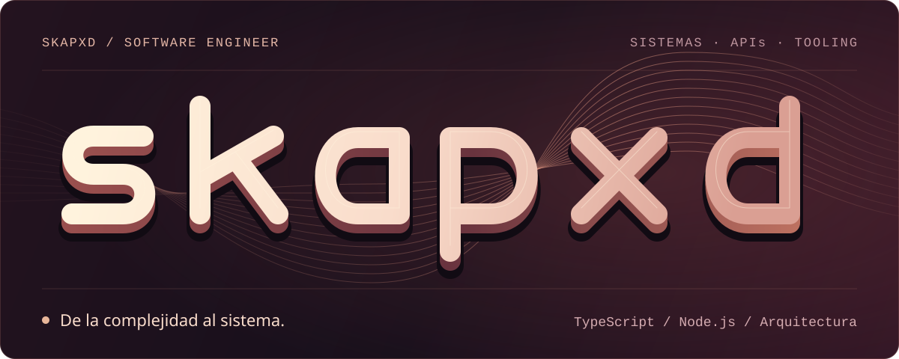

  

**Staff Software Engineer · Solutions Architect**

Construyo productos bancarios, APIs y herramientas para desarrolladores con **TypeScript y Node.js**. En **Moveo Ventures** participo en plataformas de originación de crédito, onboarding digital y motores de decisión, desde la arquitectura hasta la implementación y la operación.

[LinkedIn](https://www.linkedin.com/in/skapxd/) · [hola@skapxd.dev](mailto:hola@skapxd.dev) · [Ver CV](https://github.com/skapxd/skapxd/blob/main/cv-manuel-meneses.pdf) · [Descargar CV en PDF](https://raw.githubusercontent.com/skapxd/skapxd/main/cv-manuel-meneses.pdf)

## Experiencia aplicada

- **Banca y FinTech:** originación de créditos de vivienda y auto, reglas crediticias e integraciones de identidad y firma documental.
- **Arquitectura y desarrollo:** APIs con NestJS, aplicaciones y backoffices con Next.js, y orquestación de procesos BPMN con Camunda 8 / Zeebe.
- **Entrega y operación:** pipelines en Azure DevOps, pruebas automatizadas con Playwright y Vitest, y observabilidad con Azure Monitor y OpenTelemetry.

## Herramientas que mantengo

- **[@skapxd/lint-agent](https://github.com/skapxd/lint-agent)** — Reglas de ESLint que convierten criterios de arquitectura en validaciones ejecutables para equipos y agentes de código. [Paquete npm](https://www.npmjs.com/package/@skapxd/lint-agent).
- **[@skapxd/excel2md](https://github.com/skapxd/excel2md)** — Convierte Excel a Markdown conservando fórmulas, coordenadas y dependencias entre celdas para documentación y contexto de IA. [Paquete npm](https://www.npmjs.com/package/@skapxd/excel2md).
- **[@skapxd/tree](https://github.com/skapxd/tree)** — CLI para explorar directorios, estructura de archivos y relaciones entre código y documentos sin cargar todo el repositorio como contexto. [Paquete npm](https://www.npmjs.com/package/@skapxd/tree).
- **[@skapxd/result](https://github.com/skapxd/result)** — Manejo de errores con tipos explícitos en TypeScript mediante `Result` y `trySafe`, inspirado en Rust. [Paquete npm](https://www.npmjs.com/package/@skapxd/result).

También construí **[excel2md-web](https://excel2md-web.vercel.app/)**: una aplicación para explorar fórmulas y dependencias de un Excel y exportarlo a Markdown. Procesa los archivos en el navegador, sin registro. [Ver código](https://github.com/skapxd/excel2md-web).

## Tecnologías principales

- **Backend y procesos:** TypeScript, Node.js, NestJS, Python, Camunda 8 / Zeebe.
- **Frontend y datos:** Next.js, React, Angular, MongoDB / Mongoose, PostgreSQL, Redis.
- **Entrega y calidad:** Azure DevOps, Azure App Services, GitHub Actions, Docker, Playwright, Vitest, Cypress.

## Artículos

[Sagas coreografiadas en NestJS](https://medium.com/@manulondoo/adi%C3%B3s-al-infierno-del-debugging-coreografiando-sagas-en-nestjs-sin-perder-la-cordura-d27d091b9b76) — Eventos, trazabilidad y observabilidad en flujos asíncronos.
